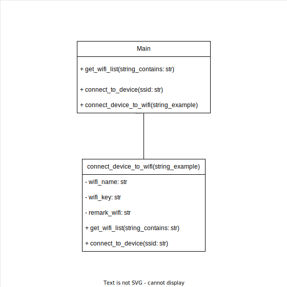

# Functionallity
The program allows the user to input data, that will be processed to provide useful output. The program wil after getting data call its function to get the wifi list, with needed devices into, and connecting with these devices. 

When all new values is set, each device will be connected to the wifi, and a **CSV file** will be generated after processing all devices.

# Useful
This program make it easy to connect many devices at same time with same values, instead of connecting each device manually. Until further there are no limit for how many devices could be processed.

For each device the program tries to connect 2 times at all.

# Installations
    pip install requests
    pip install pandas
    pip install futures


# Get started with program
## Before running
When you run the program you have to:
- Make sure that ``connect_device_to_wifi("name_of_device")`` is called in main

## When running
### Input
Insert
- Costumer name
- Workspace id

All attributes will be taken as string also if you do this:

``costumer_name: [nne]`` or ``costumer_name: {'nne'}``

``work_id: 2`` or ``work_id:{2.3}``

## While running
### Program flow:
1. Finding wifi name and password by get request to workspace server
1.  Searching in wifi list for elements conatins ``string_example`` in loop
1. Setting header coloumns for **dataframe**
1. Connect with the founded device ***Trying max 2 times***
1. Setting device data to a new row for **dataframe**
1. Identify *type* of connected device
1. Setting values including wifi settings ***not enabled yet***
1. ``Post request`` to the server with new values
1. Getting ``request.status_code`` for all request call to server
1. Updating row for **dataframe** with all values changed
1. ``Post request`` - Sending rawdata to server
1. **Enable** wifi setting
1. Generating finally ``CSV-file``

## Result
All devices is connected to a wifi, with new values. If not, the error will be set in ``CSV-file``, which will be generated at the end of the program.

# Decisions
1. Wait 1 second to search again if the elements you want in wifi list is not found
```python 
def get_wifi_list(string_contains: str)
...
time.sleep(1)
return []
```
2. Wait 2 second after finding and trying to connect each device 
```python 
def connect_to_device(ssid: str):
...
connect = os.system(command)
# Delay for 2 seconds until connecting
time.sleep(2)
...
```
3. If ``workspace`` not found or ``wifi_name == 'not provided'`` we use backup wifi
```python
wifi_name = 'NNEHotspotTest'
wifi_key = 'NNEHotspotTest'
```
4. Trying max 2 times to set values and connect each element to wifi:
```python
count = 0
while count < 2:
    count += 1
    ...
    #After connection to wifi is successfully
    count = 2 #Getting out of loop and begin with another device
```
5. Trying max 2 times to trying getting wifi list:
```python
# Trying 2 times to get wifi list
    connected = True
    test = 0

    while connected:
        # All element in wifi list
        wifi_list = get_wifi_list(string_example)

        if len(wifi_list) == 0:
            print(f"Wifi list dont conatain any element with '{string_example}'")
            test += 1

            if test == 2:
                connected = False
            # Ignoring forthcoming code
            continue
```
6. If the connection after enabling wifi is lost, that means the device is now connected to the new wifi and mission is DONE! Go to next element in list.
```python
except requests.exceptions.ConnectionError:
    # Continue with next
    print("Wifi enabled, connection lost")
    break
```

# Exception
1. When Wifi list is swicthed off at current device 
```python
raise RuntimeError("command '{}' return with error (code {}): {}".format(e.cmd, e.returncode, e.output))
```
2. When device is not able to connect and request to ``url_shelly`` failed
```python
except:
    print("Could not connect with device")
```
3. When workspace request failed:
```python
except:
    remark_wifi = "Primary wifi not found"
    print("Workspace not found - Continue with backupWIFI")
```
4. When not able to connect to server after enabling ``wifi`` which is excepted :
4.1 Device connect to another ``ip-address`` after enabling ``wifi``
```python
except requests.exceptions.ConnectionError:
    # Continue with next
    print("Wifi enabled, connection lost")
    break
```
5. When ``post/get request`` to shelly server (**url_settings**) failed:
```python
except Exception as e:
    remark_connection = f"Failed {e}"
    data_df.update({
        'Wifi status': remark_wifi,
        'SPECIAL remark': remark_connection
    })
    df.loc[len(df)] = data_df
    break
```
# Maintenance
This program will be used by NNE, and will be maintained by them as required.

# Use case


# UML diagram


# Test function / Unittest
```python
import unittest
from unittest import TestCase
from unittest.mock import patch
from main import *

class Test(TestCase):
    """
    Test for get_wifi_list
    """
    #Patching the subprocess to a costumized output
    @patch('subprocess.check_output')
    def test_get_wifi_list(self, mock_check_output):
        mock_check_output.return_value = b'SSID 1 : MyWifi1 \nSSID 2 : MyWifi2 \nSSID 3 : MyNetwork \n'

        # Test with string "Wifi" - expecting ['MyWifi1', 'MyWifi2']
        self.assertEqual(get_wifi_list("Wifi"), ['MyWifi1', 'MyWifi2'])

        # Test with string "Another" - expecting ['MyNetwork']
        self.assertEqual(get_wifi_list("Network"), ['MyNetwork'])

        # Test with string that doesn't match any element - expect []
        self.assertEqual(get_wifi_list("Default"), [])

    def test_get_wifi_list_non_string_input(self):
        # Test with non string input - expecting raise of TypeError
        with self.assertRaises(TypeError):
            get_wifi_list(123)

    """
    Test for connect_to_device
    """
    @patch('os.system')
    @patch('requests.get')
    def test_connect_to_device(self, mock_get, mock_system):
        mock_get.return_value.status_code = 200
        mock_get.return_value.json.return_value = {'mac': '00:11:22:33:44:55'}
        mock_system.return_value = 0
        result = connect_to_device('my_device')
        self.assertEqual(result, {'mac': '00:11:22:33:44:55'})

    @patch('os.system')
    def test_connect_to_device_fail_connection(self, mock_system):
        mock_system.return_value = 1

        with self.assertRaises(DeviceConnectionError):
            connect_to_device('my_device')

    @patch('requests.get')
    def test_connect_to_device_fail_get_data(self, mock_get):
        mock_get.return_value.status_code = 400

        with self.assertRaises(DeviceConnectionError):
            connect_to_device('my_device')

    def test_connect_to_device_non_string_input(self):
        result = connect_to_device(123)
        self.assertEqual(result, {})

    """
    Test for connect_device_to_wifi
    """

if __name__ == '__main__':
    unittest.main()

```
# Program
```python
import subprocess
import time
import requests
import os
import pandas as pd
import datetime

class DeviceConnectionError(Exception):
    pass

def get_wifi_list(string_contains: str):
    """
    This function get the whole wifi list and return those who conatins @param.
    :param: string_contains: a specific word you search for in wifi_list
    :return: list of wifi elements which is available and contains the string_contains or empty list if nothing found
    :except: trying to get wifilist, if something failed exception will be called.
    :raise: An CalledProcessError, as an example could be when wifi is turned off.
    """
    if not isinstance(string_contains, str):
        raise TypeError("The input must be a string")

    try:
        # Getting wifi list (available)
        output = subprocess.check_output(['netsh', 'wlan', 'show', 'network'])
        # Decoding data and split it
        networks = [line.split(':')[1][1:-1] for line in output.decode('latin-1').split('\n') if "SSID" in line]
        # Filter network and get those that contain the given string
        result = [network for network in networks if string_contains in network]
        if len(result) > 0:
            return result
        else:
            return []
    except subprocess.CalledProcessError as e:
        # Could be if wifi is switched off on laptop
        raise RuntimeError("command '{}' return with error (code {}): {}".format(e.cmd, e.returncode, e.output))
    time.sleep(1)
    return []


def connect_to_device(ssid: str):
    """
    This function take a name of the device as parameter,
    and trying to connect with the device by using OS library
    :param ssid: the name of the device
    :return: basic data of device as type, mac, ect.
    :except: if device failed to connect, exception will be called
    """

    if not isinstance(ssid, str):
        print("Ssid not a string")
        return {}
    else:
        # Command to connect to the device
        command = "netsh wlan connect name=\"" + ssid + "\" ssid=\"" + ssid + "\" interface=Wi-Fi"
        # Try to connect
        try:
            print("Trying to connect with", ssid)
            connect = os.system(command)
            print(connect, "printer")
            # Delay for 2 seconds until connecting
            time.sleep(2)

            # If connecting sucessfully
            if connect == 0:
                url_shelly = 'http://192.168.33.1/shelly'
                data_shelly = requests.get(url_shelly)
                if data_shelly.status_code == 200:
                    print("Mac addresse:", data_shelly.json()['mac'])
                    return data_shelly.json()
                else:
                    raise DeviceConnectionError("Failed to retrieve data from device")
            else:
                raise DeviceConnectionError("Failed to connect to device")

        # connection failed
        except Exception as e:
            raise DeviceConnectionError("Could not connect with device") from e


def connect_device_to_wifi(string_example: str, costumer_name: str = input("Kundenavn: "), work_id: int = input("Indtast workspace id: "),
                           wifi_backup_name: str = "NNEHotspotTest", wifi_backup_password: str = "NNEHotspotTest", program_version: str = 'v.0.1'):
    """
    This function has to connect each device with the wifi, and setting the values
    :param string_example: The part of device name you searching for
    :param wifi_name
    :param wifi_key
    :param wifi_backup_name
    :param wifi_backup_password
    :return: Device connected to wifi, and all values is set
    """
    #Declare attribute
    wifi_name = 'NNEHotspotTest'
    wifi_key = 'NNEHotspotTest'
    remark_wifi = ""
    url_rawdata = "https://rawdata-cifpsw2ysq-ew.a.run.app/rawentry"
    #Getting wifi from workspace if exist else use backup
    try:
        workspace_res = requests.get(
            f'https://workspaces-services-cifpsw2ysq-ew.a.run.app/api/workspaces?text={costumer_name}')
        print(workspace_res.json())
        for workspace in workspace_res.json():
            if workspace_res.ok and workspace['id'] == int(work_id):
                if workspace['ssid'] != 'not provided' and workspace['ssid_pass'] != 'not provided':
                    wifi_name = workspace['ssid']
                    wifi_key = workspace['ssid_pass']
                    break #Stops the loop if found
                else:
                    remark_wifi = "Primary wifi not found"
    except:
        remark_wifi = "Primary wifi not found"
        print("Workspace not found - Continue with backupWIFI")

    # Trying 2 times to connect to the list of devices
    connected = True
    while connected:

        # All element in wifi list
        wifi_list = get_wifi_list(string_example)

        if len(wifi_list) == 0:
            print(f"Wifi list dont conatain any element with '{string_example}'")
            # Ignoring forthcoming code
            continue

        print(wifi_list)
        print("-----------------------------------------")

        # Dataframe header:
        df = pd.DataFrame(
            columns=['Version','Costumer_name','Workspace_id','Name_of_device', 'Type', 'Mac_Address','Date', 'Wifi_name', 'Wifi_backup_name', 'Mqtt_server',
                     'Mqtt_enable', 'Mqtt_retain', 'Mqtt_user', 'Mqtt_update_period', 'Auto_on', 'Wifi status','SPECIAL remark'])

        for device_name in wifi_list:
            count = 0
            while count < 2:
                count += 1
                # Connecting to each device
                device_data = connect_to_device(device_name)
                if device_data == None:
                    break
                print(f"This is {count} time for device:{device_data['mac']}")
                data_df = {
                    'Version': program_version,
                    'Costumer_name': costumer_name,
                    'Workspace_id': work_id,
                    'Name_of_device': device_name,
                    'Type': device_data['type'].upper(),
                    'Mac_Address': device_data['mac'],
                    'Date': datetime.datetime.utcnow().strftime('%Y-%m-%dT%H:%M:%S.%fZ'),
                    'Wifi_name': wifi_name,
                    'Wifi_backup_name': wifi_backup_name
                }

                # Generation 1
                if device_data['type'].upper() == 'SHPLG-S':
                    # Url for request
                    url_settings = 'http://192.168.33.1/settings'
                    # Data that needs to be posted
                    payload_first_wifi = {'ssid': f'{wifi_name}', 'key': f'{wifi_key}'}
                    payload_second_wifi = {'ssid': f'{wifi_backup_name}', 'key': f'{wifi_backup_password}'}
                    # Checking status code of request
                    payload_settings = {
                        'mqtt_enable': True,
                        'mqtt_retain': True,
                        'mqtt_user': "",
                        'mqtt_update_period': 300,
                        'mqtt_server': "35.206.187.30:" +
                                       requests.get(url_settings).json()['mqtt']['server'].split(':')[1]
                    }

                    # HTTP reuqest
                    try:
                        res_relay = requests.post(url_settings + '/relay/0', data={'auto_on': 120})
                        res_settings = requests.post(url_settings, data=payload_settings)
                        res_second_wifi = requests.post(url_settings + '/sta1', data=payload_second_wifi)
                        res_first_wifi = requests.post(url_settings + '/sta', data=payload_first_wifi)
                        data_get = requests.get(url_settings).json()
                        print(
                            f'Relay: {res_relay.status_code} {res_relay.text}  \nSettings_ {res_settings.status_code} {res_settings.text}  '
                            f'\nWifi_First {res_first_wifi.status_code} {res_first_wifi.text}  \nWifi_Second {res_second_wifi.status_code} {res_second_wifi.text}')

                        #TODO: must be changed after connection enabled
                        remark_connection = "OK"

                        # Define a row for dataframe
                        data_df.update({
                            'Mqtt_server': data_get['mqtt']['server'] ,
                            'Mqtt_enable': data_get['mqtt']['enable'],
                            'Mqtt_retain': data_get['mqtt']['retain'],
                            'Mqtt_user': data_get['mqtt']['user'],
                            'Mqtt_update_period': data_get['mqtt']['update_period'],
                            'Auto_on': data_get['relays'][0]['auto_on'],
                            'Wifi status': remark_wifi,
                            'SPECIAL remark': remark_connection
                        })
                        df.loc[len(df)] = data_df

                        #TODO send rawdata back by http req
                        payload_rawData_sensor38 = {
                            "physical_id": data_get['mqtt']['id'],
                            "hub_id": costumer_name,
                            "measured_ts":datetime.datetime.utcnow().strftime('%Y-%m-%dT%H:%M:%S.%fZ'),
                            "relayed_ts": datetime.datetime.utcnow().strftime('%Y-%m-%dT%H:%M:%S.%fZ'),
                            "sensor_type": 38,
                            "topic": "SHELLY",
                            "value": wifi_name,
                            "packet_version": 1
                        }
                        payload_rawData_sensor0 = {
                            "physical_id": data_get['mqtt']['id'],
                            "hub_id": costumer_name,
                            "measured_ts":datetime.datetime.utcnow().strftime('%Y-%m-%dT%H:%M:%S.%fZ'),
                            "relayed_ts": datetime.datetime.utcnow().strftime('%Y-%m-%dT%H:%M:%S.%fZ'),
                            "sensor_type": 0,
                            "topic": "SHELLY",
                            "value": f"Restart cause: 0; Version: {program_version}, Woke: {datetime.datetime.utcnow().strftime('%Y-%m-%dT%H:%M:%S.%fZ')}",
                            "packet_version": 1

                        }
                        requests.post(url_rawdata, data= payload_rawData_sensor38)
                        requests.post(url_rawdata, data= payload_rawData_sensor0)

                        # Enable wifi
                        # enable_wifi = requests.post(url_settings + '/sta', {'enabled': 1})
                        # print("wifi enabled", enable_wifi.status_code)

                    except requests.exceptions.ConnectionError:
                        # Continue with next
                        print("Wifi enabled, connection lost")
                        break
                    except Exception as e:
                        remark_connection = f"Failed {e}"
                        data_df.update({
                            'Wifi status': remark_wifi,
                            'SPECIAL remark': remark_connection
                        })
                        df.loc[len(df)] = data_df
                        break
                    # Exit loop
                    count = 2
                # Generation PLUS S MODEL
                elif device_data['type'].upper() != 'SHPLG-S':
                    # Url for request
                    url_gen2_wifi_set = "http://192.168.33.1/rpc/WiFi.SetConfig"
                    url_gen2_mqtt_set = "http://192.168.33.1/rpc/MQTT.SetConfig"
                    url_gen2_wifi_get = "http://192.168.33.1/rpc/WiFi.GetConfig"
                    url_gen2_mqtt_get = "http://192.168.33.1/rpc/MQTT.GetConfig"
                    # Data for request
                    payload_gen2_wifi = {
                        "sta": {
                            'ssid': f'{wifi_name}',
                            'key': f'{wifi_key}'
                        },
                        "sta1": {
                            'ssid': f'{wifi_backup_name}',
                            'key': f'{wifi_backup_password}'
                        }
                    }
                    res_mqtt_gen2 = requests.get(url_gen2_mqtt_get)
                    payload_gen2_mqtt = {
                        "enable": True,
                        "user": "",
                        "server": "35.206.187.30:" + res_mqtt_gen2.json()['server'].split(':')[1]

                    }

                    # HTTP request
                    try:
                        requests.post(url_gen2_wifi_set, params={"config": payload_gen2_wifi})
                        requests.post(url_gen2_mqtt_set, params={"config": payload_gen2_mqtt})

                        # Get information and append information to dict list (rows of csv file)
                        data_get_wifi = requests.get(url_gen2_wifi_get)
                        data_get_mqtt = requests.get(url_gen2_mqtt_get)

                        # TODO: must be changed after connection enabled
                        remark_connection = "OK"
                        data_df.update({
                            'Mqtt_server': data_get_mqtt['mqtt']['server'],
                            'Mqtt_enable':  data_get_mqtt['mqtt']['enable'],
                            'Mqtt_retain': "",
                            'Mqtt_user': data_get_mqtt['mqtt']['user'],
                            'Mqtt_update_period': "",
                            'Auto_on': "",
                            'Wifi status': remark_wifi,
                            'SPECIAL remark': remark_connection
                        })
                        df.loc[len(df)] = data_df

                        #TODO send rawdata back by http req
                        payload_rawData_sensor38_gen2 = {
                            "physical_id": data_get_mqtt['mqtt']['client_id'],
                            "hub_id": costumer_name,
                            "measured_ts": datetime.datetime.utcnow().strftime('%Y-%m-%dT%H:%M:%S.%fZ'),
                            "relayed_ts": datetime.datetime.utcnow().strftime('%Y-%m-%dT%H:%M:%S.%fZ'),
                            "sensor_type": 38,
                            "topic": "SHELLY",
                            "value": wifi_name,
                            "packet_version": 1
                        }
                        payload_rawData_sensor0_gen2 = {
                            "physical_id": data_get_mqtt['mqtt']['client_id'],
                            "hub_id": costumer_name,
                            "measured_ts": datetime.datetime.utcnow().strftime('%Y-%m-%dT%H:%M:%S.%fZ'),
                            "relayed_ts": datetime.datetime.utcnow().strftime('%Y-%m-%dT%H:%M:%S.%fZ'),
                            "sensor_type": 0,
                            "topic": "SHELLY",
                            "value": f"Restart cause: 0; Version: {program_version}, Woke: {datetime.datetime.utcnow().strftime('%Y-%m-%dT%H:%M:%S.%fZ')}",
                            "packet_version": 1

                        }
                        requests.post(url_rawdata, data=payload_rawData_sensor38_gen2)
                        requests.post(url_rawdata, data=payload_rawData_sensor0_gen2)

                        # Connecting to wifi
                        payload_gen2_wifi["sta"]["enable"] = True
                        requests.post(url_gen2_wifi_set, params={"config": payload_gen2_wifi})


                    except requests.exceptions.ConnectionError:
                        print("Wifi enabled, connection lost")
                        break
                    except Exception as e:
                        remark_connection = f"Failed {e}"
                        data_df.update({
                            'Wifi status': remark_wifi,
                            'SPECIAL remark': remark_connection
                        })
                        df.loc[len(df)] = data_df
                        break
                    # Exit loop
                    count = 2

        # Converting to a csv
        df.to_csv("Shelly-Plug.csv")
        #Breaking whole loop and program stops
        break


# Main
connect_device_to_wifi("shelly")

```
